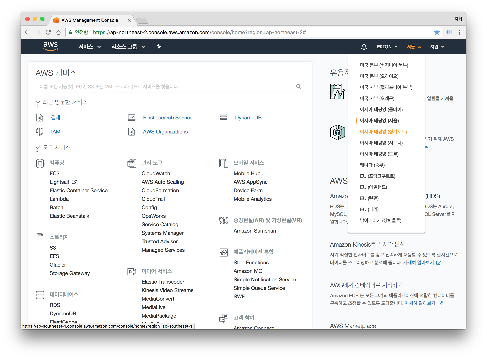
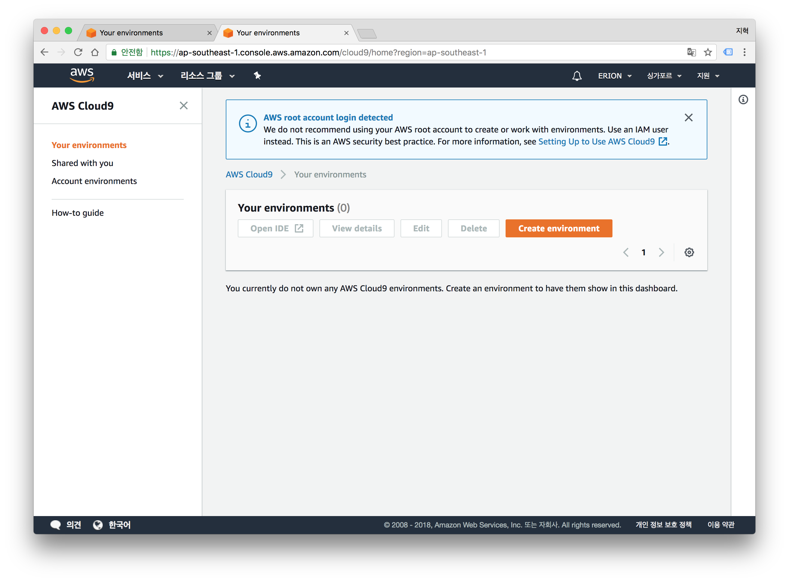
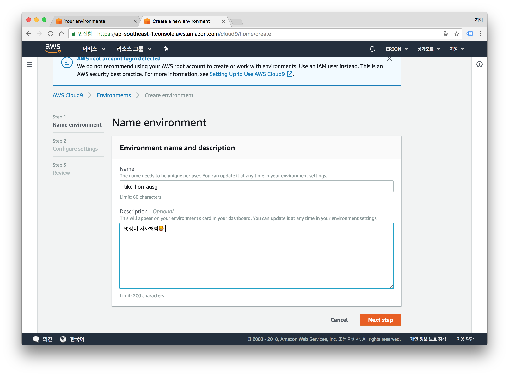
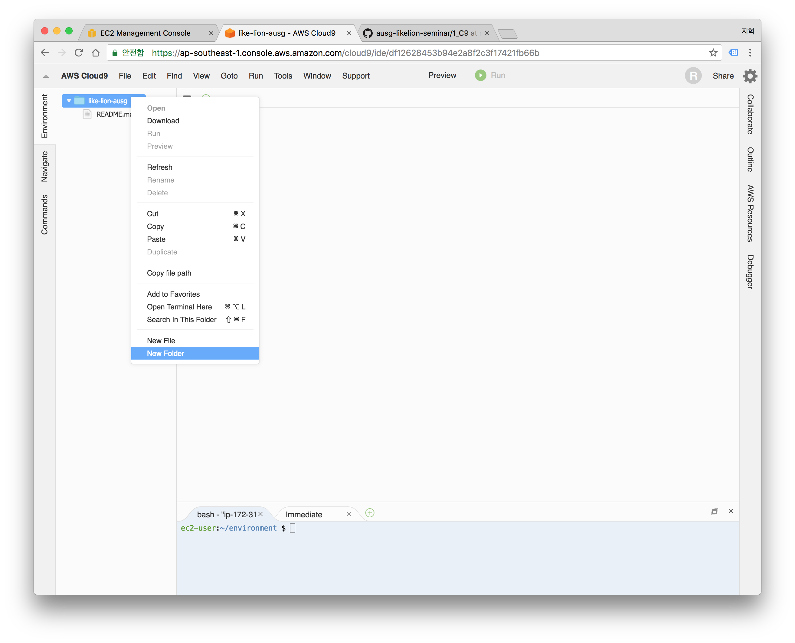
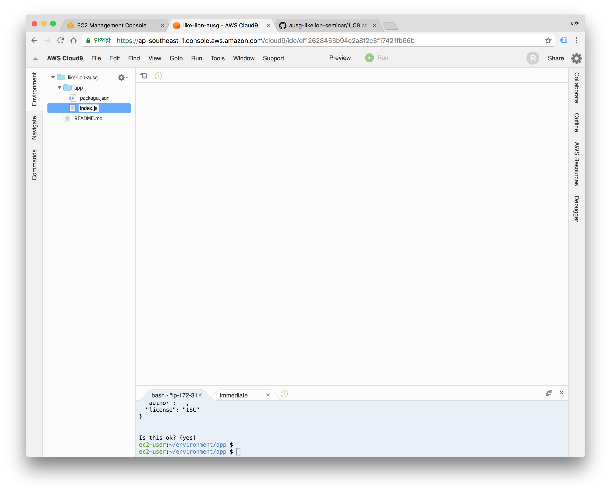
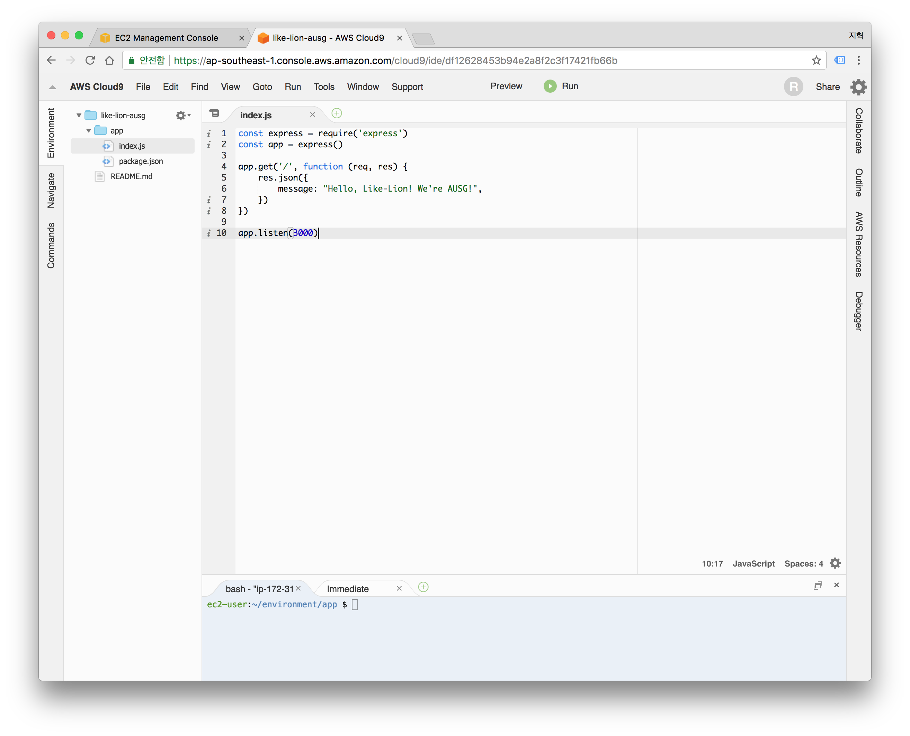
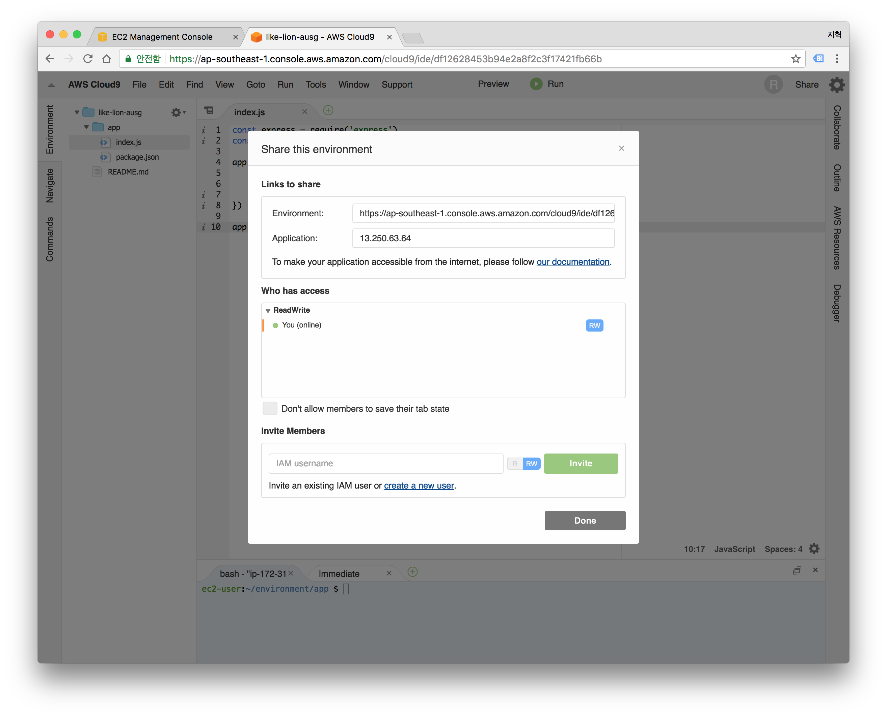
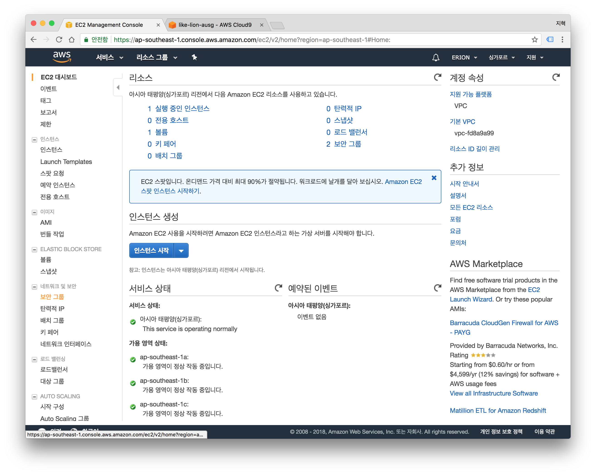
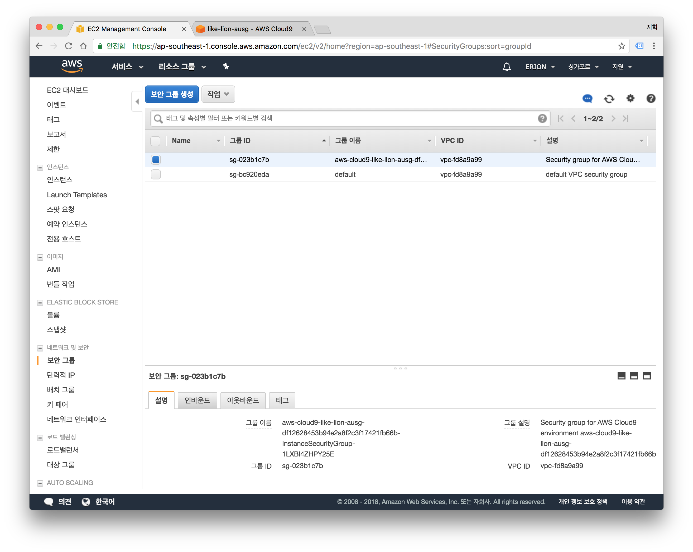

# AWS Cloud9
<!--  -->

AWS Cloud9은 인터넷만 연결되어 있다면 웹 브라우저상으로 코드 작성 및 실행, 디버깅을 할 수 있는 클라우드 기반의 통합 개발 환경(Integrated Development Environment)입니다. [서비스 소개](https://aws.amazon.com/ko/cloud9/)  

# AWS Cloud9 생성하기 
- 싱가폴 리전을 선택합니다.

- AWS Cloud9 서비스로 이동합니다

- Create Environment 버튼을 클릭합니다.

- Cloud9 환경의 이름과 세부정보를 적습니다.

- 아래의 설정과 동일하게 맞춰주세요.

- Next Step 버튼을 클릭합니다.  
- 설정한 값들을 확인 한 후 Create Environment 버튼을 클릭합니다.
> 이때, 자동으로 EC2가 생성됩니다.  


# 기본적인 Node.js 앱 만들기
설정 테스트를 위해 기본적인 Node.js 앱을 만들어보도록 하겠습니다. Cloud9 환경에는 기본적으로 Node.js가 설치되어 있으므로 따로 Cloud9에 설치하실 필요는 없습니다.
> 2018년 5월 12일 기준으로 6.14.1 버전이 설치되어 있습니다.

- 왼쪽 위 파일 브라우저에서 오른쪽 클릭해 새로운 폴더를 만듭니다. (`New Folder` 클릭)
- 
- 폴더 이름을 `app`으로 입력합니다. (임의로 설정하셔도 좋습니다)  
- 아래 터미널에서 `cd` 명령어를 이용해 `app` 폴더로 이동합니다.

```bash
$ cd app
```

- app 폴더로 맞게 이동하셨다면, (터미널 왼쪽에 `ec2-user:~/environment/app` 이라고 나오게 됩니다.) `npm init` 명령어를 이용해 새로운 프로젝트를 만들어줍니다.  

```bash
$ npm init
```

- 몇가지 선택 사항을 물어보는데, 모두 기본값을 사용합니다. (엔터 계속 입력)
- 프로젝트 생성이 완료되었다면 마찬가지로 왼쪽의 브라우저 탭에서 오른쪽 클릭해 `New File`을 선택하고
- 이름은 `index.js`로 설정합니다.
- 
- 왼쪽에서 생성된 `index.js`을 더블 클릭해 열어 준 뒤, 샘플 코드를 다음과 같이 작성합니다.

```javascript
const express = require('express')
const app = express()

app.get('/', function (req, res) {
    res.json({
        message: "Hello, Like-Lion! We're AUSG!",
    })
})

app.listen(3000)
```



- 터미널에서 해당 앱을 실행합니다.  

```bash
$ node index.js
```

- 오른쪽 위의 Share 버튼을 클릭합니다.
- 
- Links to share의 Application IP 주소를 확인합니다.
- 

# 인스턴스 보안 설정
- `EC2` 서비스로 이동합니다.

- `네트워크 및 보안` → `보안 그룹` 으로 이동합니다.  

- 지은 이름에 해당하는 보안 그룹을 선택 한 후 하단의 `인바운드` 탭을 선택합니다.

- `편집`을 클릭해 인바운드 규칙을 아래의 그림과 같이 추가한 뒤 `저장` 버튼을 누릅니다.
> 인바운드 규칙 추가를 통해 원하는 포트 번호를 추가 할 수 있습니다. 오늘 우리는 임의적으로 3000번 포트를 열었습니다. 일반적인 HTTP 기본 포트는 `80`, HTTPS 기본 포트는 `443`을 사용합니다.


실습이 완료되면 다음모듈인 [2. S3 생성하기](../2_S3) 으로 이동하십시오
