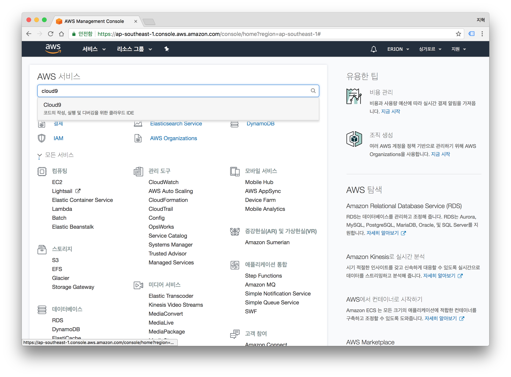
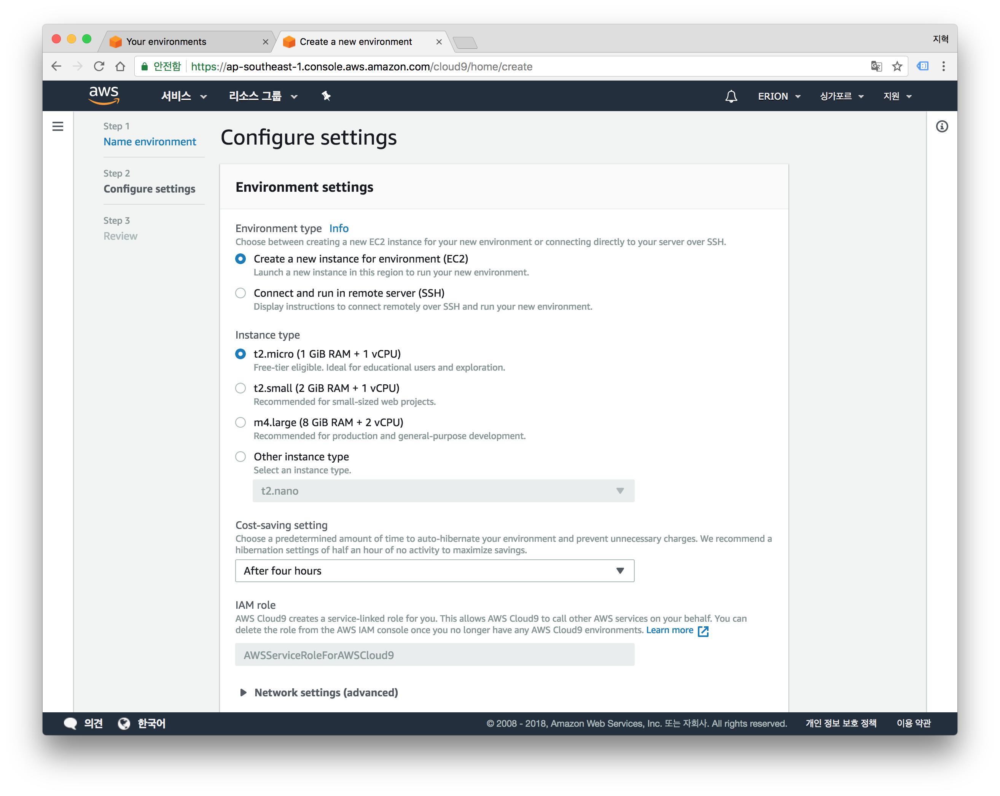
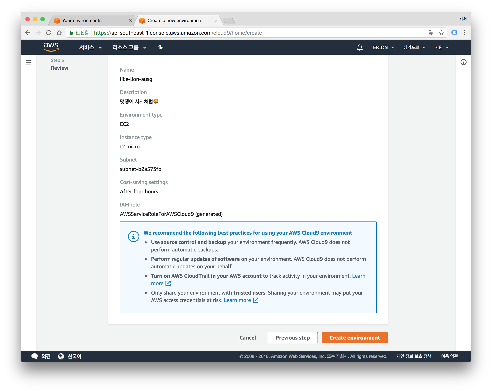
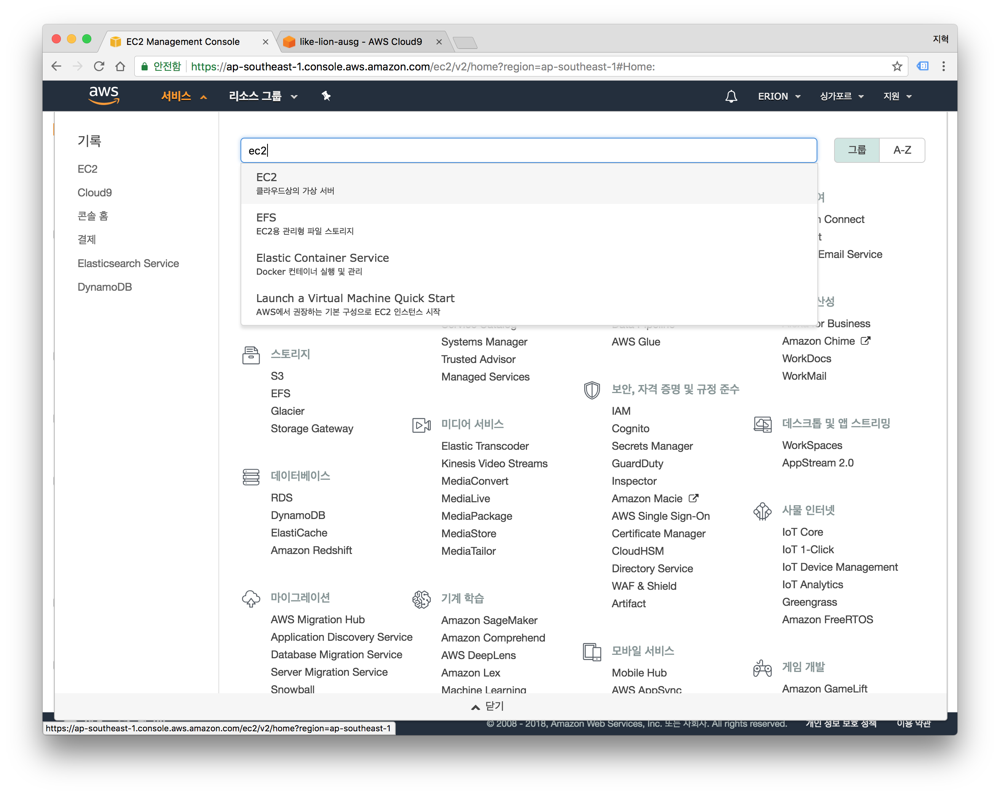
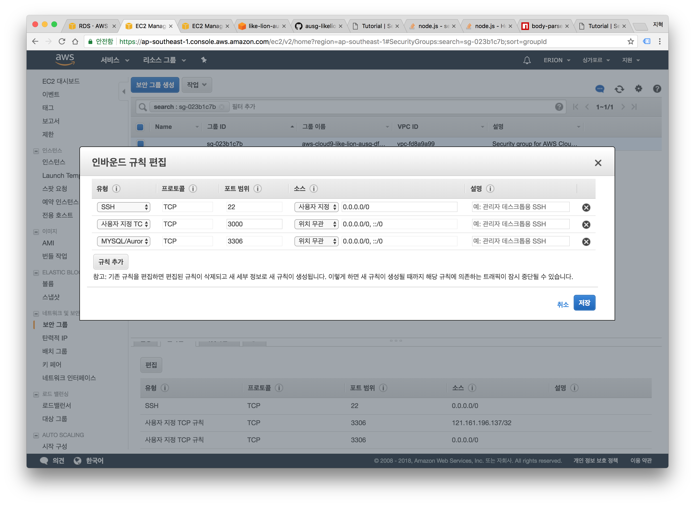

# AWS Cloud9
<!--  -->

AWS Cloud9은 인터넷만 연결되어 있다면 웹 브라우저상으로 코드 작성 및 실행, 디버깅을 할 수 있는 클라우드 기반의 통합 개발 환경(Integrated Development Environment)입니다. [서비스 소개](https://aws.amazon.com/ko/cloud9/)  

# AWS Cloud9 생성하기 
- 싱가폴 리전을 선택합니다.

- AWS Cloud9 서비스로 이동합니다

- Create Environment 버튼을 클릭합니다.

- Cloud9 환경의 이름과 세부정보를 적습니다.

- 아래의 설정과 동일하게 맞춰주세요.

- Next Step 버튼을 클릭합니다.  
- 설정한 값들을 확인 한 후 Create Environment 버튼을 클릭합니다.
> 이때, 자동으로 EC2가 생성됩니다.  

# 인스턴스 보안 설정
- `EC2` 서비스로 이동합니다.

- `네트워크 및 보안` → `보안 그룹` 으로 이동합니다.  

- 지은 이름에 해당하는 보안 그룹을 선택 한 후 하단의 `인바운드` 탭을 선택합니다.

- `편집`을 클릭해 인바운드 규칙을 아래의 그림과 같이 추가한 뒤 `저장` 버튼을 누릅니다.
> 인바운드 규칙 추가를 통해 원하는 포트 번호를 추가 할 수 있습니다. 오늘 우리는 임의적으로 3000번 포트를 열었습니다. 일반적인 HTTP 기본 포트는 `80`, HTTPS 기본 포트는 `443`을 사용합니다.

실습이 완료되면 다음모듈인 [2. S3 생성하기](../2_S3) 으로 이동하십시오
