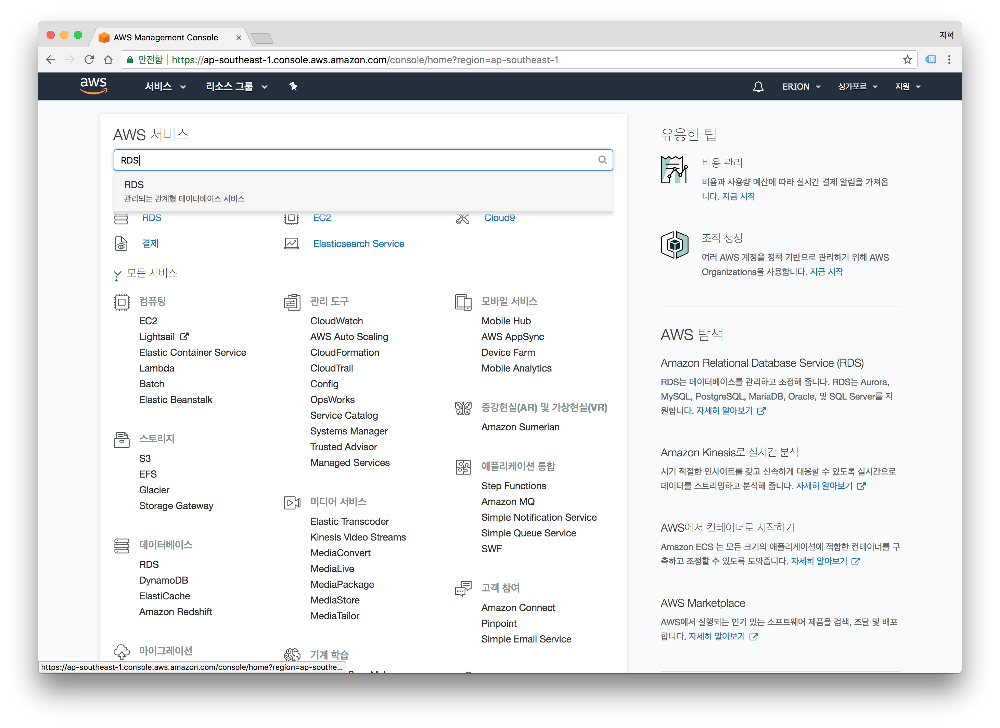
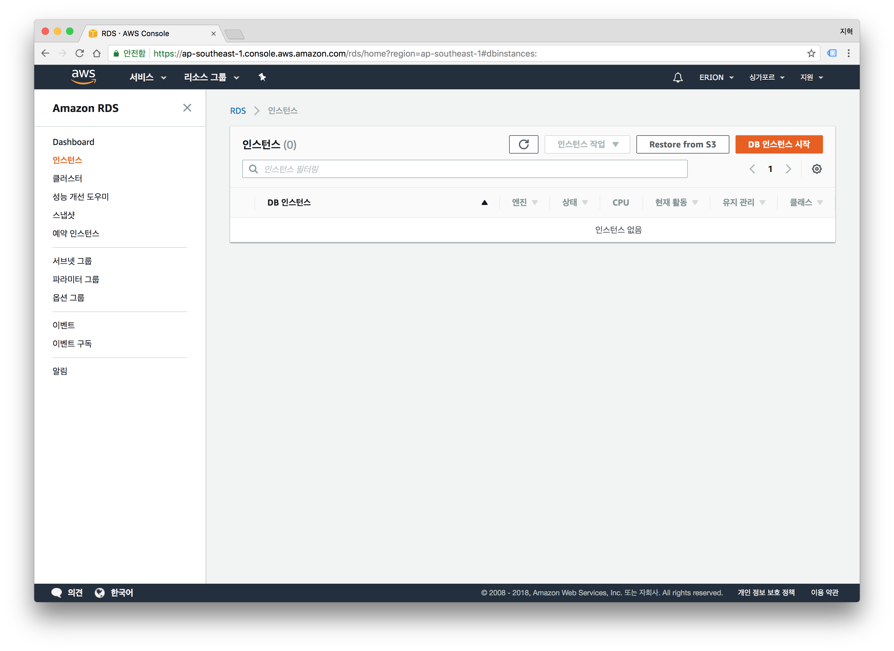
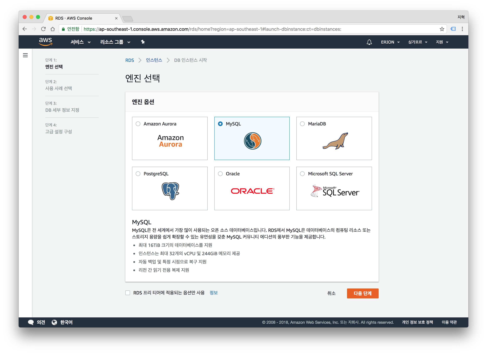
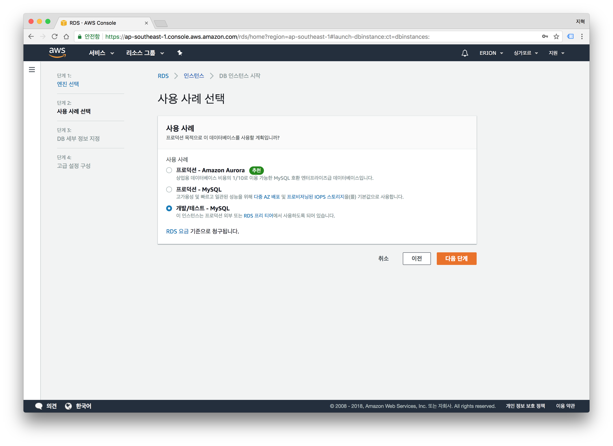
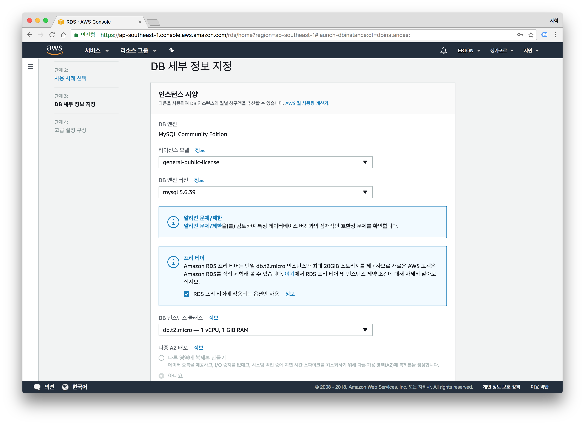
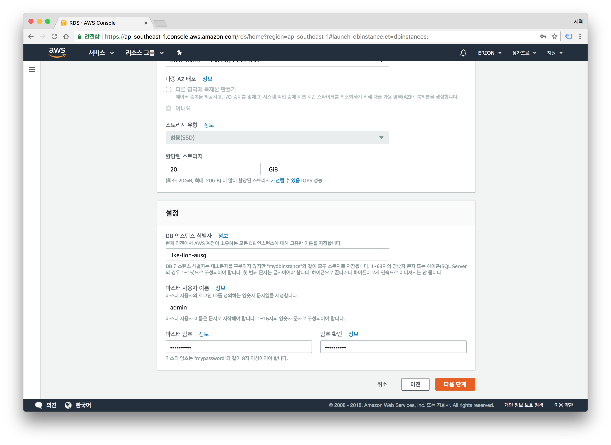
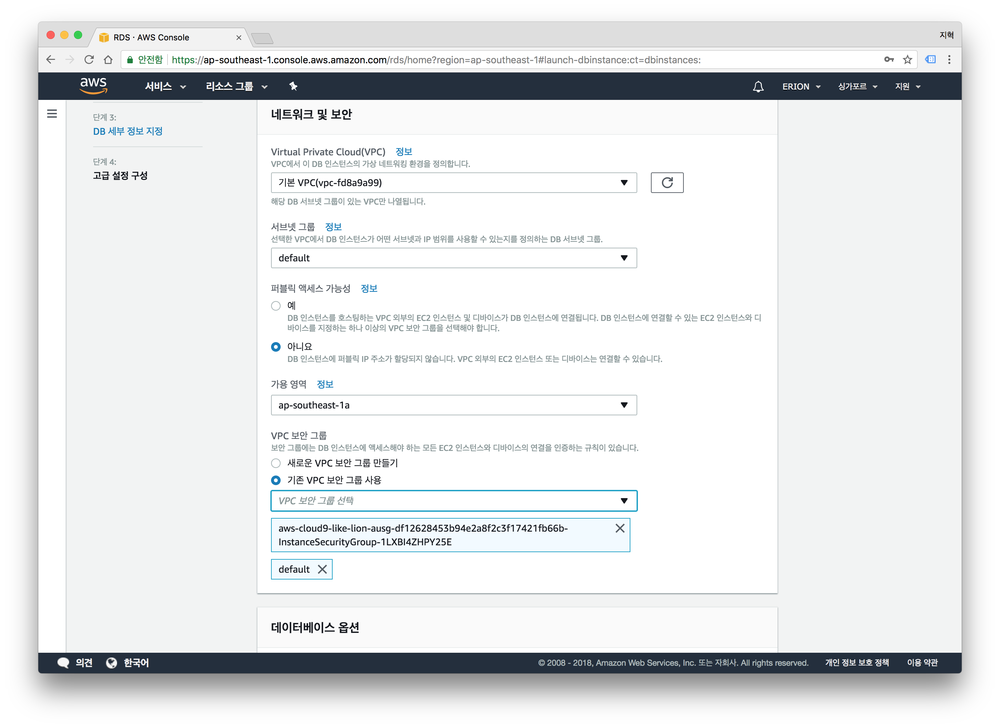
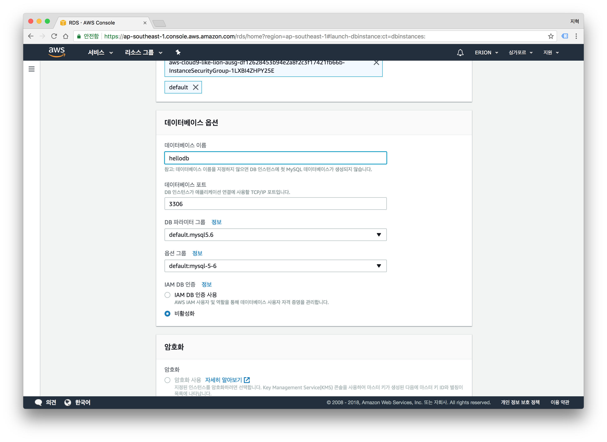
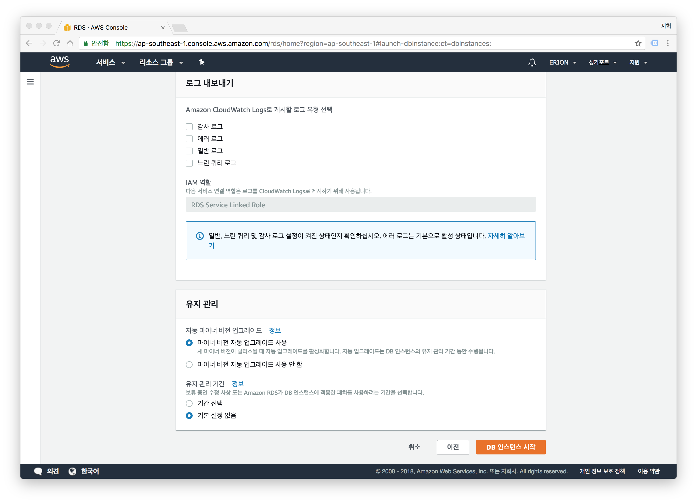
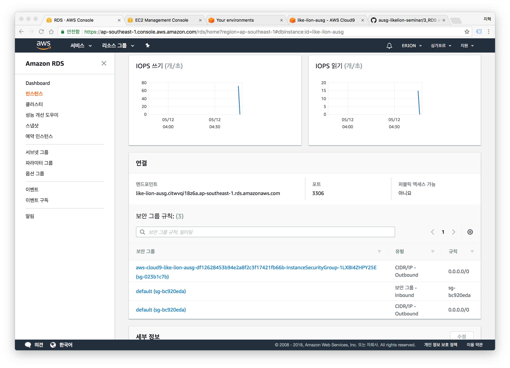

# AWS RDS

## RDS 생성하기
- AWS Console로 이동합니다.
- 싱가포르 리전을 확인합니다.
- RDS 서비스로 이동합니다.

- 좌측 탭에서 인스턴스탭을 선택합니다.
- `DB 인스턴스 시작`을 클릭합니다.

- `MySQL`을 선택 한 뒤 `다음 단계`를 클릭합니다. 

- `개발/테스트 - MySQL`을 선택 한 뒤, `다음 단계`를 클릭합니다.

- 프리티어 타이틀의  `RDS 프리 티어에 적용되는 옵션만 사용`에 체크합니다.

- 페이지 하단의 설정에서,
	- DB 인스턴스 식별자에 DB 인스턴스의 이름을 입력합니다.
	- 마스터 사용자 이름에 DB의 root계정으로 사용할 ID를 입력합니다.
	- 마스터 암호와 암호확인에 DB root계정의 암호를 입력합니다.
	- `다음 단계`를 클릭합니다.

- `네트워크 및 보안` → `가용영역` → `ap-southeast-1a`를 선택합니다.
- `네트워크 및 보안` -> `기존 VPC 보안 그룹 사용` 체크 -> *C9과 같은 이름을* 가진 보안그룹을 선택합니다.

- `데이터베이스 옵션` -> `데이터베이스 이름`에 `hellodb`를 입력합니다.

- 다른 설정은 그대로 두신 뒤, `DB 인스턴스 시작`을 클릭합니다.

- 인스턴스가 생성 될 때까지 3~10분정도 소요됩니다. 잠시 기다려주세요.
  
## MySQL 엔드포인트 확인
- 좌측 탭의 `인스턴스`를 클릭합니다.
- 방금 만든 DB 인스턴스의 이름을 클릭합니다.
- 아래로 내리면 `연결` 파트에 엔드포인트가 나타납니다. 확인하세요.
- 

축하드립니다! 실습이 완료되셨으면, 다음 모듈인 [Sequelize.js](../4_Sequelize_js)로 이동하세요.